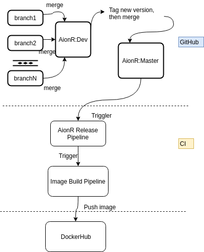
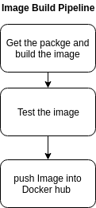

## Purpose of this Repo
* Backup Dockerfiles
* Setup Jenkins pipeline to create AionR Docker images, test them and push them to Docker hub automatically


## Expect Content
* 2 Dockerfiles to build AionR execution environment for ub18.04, ub16.04
* 2 Dockerfiles to build the images contains the latest AionR package
* Jenkinfile to build images and push them into docker hub or other image storage system
* A shell script to trigger the testing

## Image Info
* The work directory of docker images is /aionr. The structure is the same as [the executable package](https://github.com/aionnetwork/aionr/wiki/User-Manual#launch-aionr-kernel)
* The runing data is located at /root/.aion. Mounting a volume or binding a host space to this directory is recommended.
* Default Command is launching AionR to connect to Mainnet
* Expose Ports:
  * 30303 (P2P)
  * 8545 (RPC HTTP)
  * 8546 (RPC WebSocket)
  * 8547 (Wallet)
  * 8008 (Stratum)

## Manual Build Image
* Download the [executiable package](https://github.com/aionnetwork/aionr/releases)
* Or Build from [Source Code](https://github.com/aionnetwork/aionr)
* Then put the package folder in this repo
```
docker build --file <DockerfileName> --build-arg PACKAGE_LOCATION=<new built AionR package Location> -t <imageRepo:tag> .
```


## Integrate with Jenkins Release Build
### Expected AionR Release Flow

* A new Jenkinsfile will be added to AionR repo for release purpose. The last step of the new pipeline is to trigger the image building and passing the current kernel version.  

### Expected AionR Image Building Flow

* Test Image using JSON RPC requests,the entire test frame is [/chaion/qa-rpc repo](/chaion/qa-rpc)
* The pipeline tests both HTTP and WebSocket.
* It pushes the image to Docker Hub after testing completed
  * Docker Hub:[https://hub.docker.com/u/aionnetworkdocker/aionr](https://hub.docker.com/u/aionnetworkdocker/aionr)


## Use Image
Prerequisite: Docker

### Deploy Images
#### Get the image:
1) Use the dockerfile, check [Manual Build Image](#manual-build-image)
2) Pull from Docker Hub:
```bash
docker pull aionnetworkdocker/aionr:0.1.1
```

#### Run Docker Container
```bash
docker run -p 30303:30303 -p 8545:8545 -p 8546:8546 -p 8547:8547 -p 8008:8008 aionnetworkdocker/aionr:0.1.1
```

* Run container with custom/mastery network
```bash
docker run -p 30303:30303 -p 8545:8545 -p 8546:8546 -p 8547:8547 -p 8008:8008 aionnetworkdocker/aionr:0.1.1 ./mastery.sh
```

* To mount a volume or host directory to the Container

```bash
docker run -p 30303:30303 -p 8545:8545 -p 8546:8546 -p 8547:8547 -p 8008:8008 --mount src=/host/dir/path/or/volumn/name,dst=/container/dir/path aionnetworkdocker/aionr:0.1.1
```
For example:
  1. create a volume and mount it with aionr data directory:
```bash
docker create volume aionrdata

docker run -p 30303:30303 -p 8545:8545 -p 8546:8546 -p 8547:8547 -p 8008:8008 --mount type=volume,src=aionrdata,dst=/root/.aion aionnetworkdocker/aionr:0.1.1
```

  2. bind a host directory with aionr data directory:
```bash
# /host/location must be existed
docker run -p 30303:30303 -p 8545:8545 -p 8546:8546 -p 8547:8547 -p 8008:8008 --mount type=bind,src=/host/location,dst=/root/.aion aionnetworkdocker/aionr:0.1.1

# Or /host/location does not have to be existed
docker run -p 30303:30303 -p 8545:8545 -p 8546:8546 -p 8547:8547 -p 8008:8008 -v /host/location:/root/.aion aionnetworkdocker/aionr:0.1.1

```
To check the structure of `/root/.aion`, go [AionR Wiki page](https://github.com/aionnetwork/aionr/wiki/User-Manual#launch-aionr-kernel-with-a-specific-chain)

#### Configure Kernel
##### configure Kernel in the docker container
After the container is running, users can edit the configuration of each network through `docker exec`

```bash
docker exec -it <container_name or hash> /bin/bash
```

Then edit `[NETWORK]\[NETWORK].toml`

##### configure Kernel in the host
In some cases, users want to use the configuration and genesis file in the host. Users can mount a host directory that **contains** `[NETWORK].toml` and `[NETWORK].json`.
```bash
docker run -p 30303:30303 -p 8545:8545 -p 8546:8546 -p 8547:8547 -p 8008:8008 \
--mount type=bind,src=/host/db,dst=/root/.aion \
--mount type=bind,src=/host/mainnet,dst=/aionr/mainnet \
aionnetworkdocker/aionr:0.1.1
```

If there is no configuration file and genesis file in the host,
1. use `docker cp` to get the default configurations and genesis files from the docker container:
```bash
# 1. launch a container using aionnetworkdocker/aionr:0.1.1
docker run -d --name aionr aionnetworkdocker/aionr:0.1.1
# 2. cp the folders to the host
docker cp aionr:/aionr/mainnet /host/mainnet/directory
docker cp aionr:/aionr/mastery /host/mastery/directory
docker cp aionr:/aionr/custom /host/custom/directory
# 3. stop and remove the container
docker stop aionr
docker rm aionr
# 4. edit configuration on the host and launch the container again
docker run -p 30303:30303 -p 8545:8545 -p 8546:8546 -p 8547:8547 -p 8008:8008 \
--mount type=bind,src=/host/db,dst=/root/.aion \
--mount type=bind,src=/host/mainnet/directory,dst=/aionr/mainnet \
aionnetworkdocker/aionr:0.1.1

```

2. Get the configurations in the executive package on [Github](https://github.com/aionnetwork/aionr/releases)
